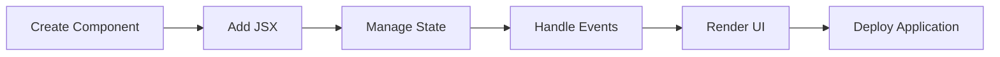

<div align="center">

# ⚛️ React JS Mastery


<br>


</div>

---

## 🚀 About React JS

React is a powerful JavaScript library developed by Meta for building fast, scalable, and interactive user interfaces.

### ✨ Key Features

- ⚡ Virtual DOM
- 🧩 Reusable Components
- 🎣 React Hooks
- 🔄 State Management
- 🚀 High Performance
- 📱 Responsive Applications
- 🌐 Single Page Applications (SPA)

---

## ⚛️ React Ecosystem

<div align="center">


</div>

---

## 📂 Project Structure

```bash
React-App/
│
├── public/
├── src/
│   ├── components/
│   ├── pages/
│   ├── hooks/
│   ├── assets/
│   ├── App.jsx
│   └── main.jsx
│
├── package.json
└── README.md
```

---

## 🎯 React Core Concepts

| Concept | Description |
|----------|-------------|
| Components | Reusable UI blocks |
| JSX | HTML-like syntax in JavaScript |
| Props | Pass data between components |
| State | Manage dynamic data |
| Hooks | Add functionality to components |
| Router | Navigation between pages |
| Context API | Global State Management |

---

## 🔥 React Learning Path

```text
HTML → CSS → JavaScript
         ↓
       React
         ↓
      Components
         ↓
        Props
         ↓
        State
         ↓
        Hooks
         ↓
      React Router
         ↓
      Context API
         ↓
      Advanced React
```

---

## 📊 Repository Stats

<div align="center">


</div>

---

## 📈 Most Used Languages

<div align="center">


</div>

---

## 🌟 React Workflow



---

## 💻 Sample React Component

```jsx
function Welcome() {
  return (
    <div>
      <h1>Hello React 🚀</h1>
      <p>Build modern applications easily.</p>
    </div>
  );
}

export default Welcome;
```

---

## 🎨 React Logo Animation

<div align="center">


</div>

---

## 🤝 Contributing

1. Fork Repository
2. Create Feature Branch
3. Commit Changes
4. Push Changes
5. Create Pull Request

---

## ⭐ Support

If this repository helped you learn React, give it a ⭐.

---

<div align="center">

### ⚛️ Happy React Coding ⚛️


</div>

---

### 🏢 GD Team PVT. LTD.
### 👨‍💻 Developed for React JS Learners
